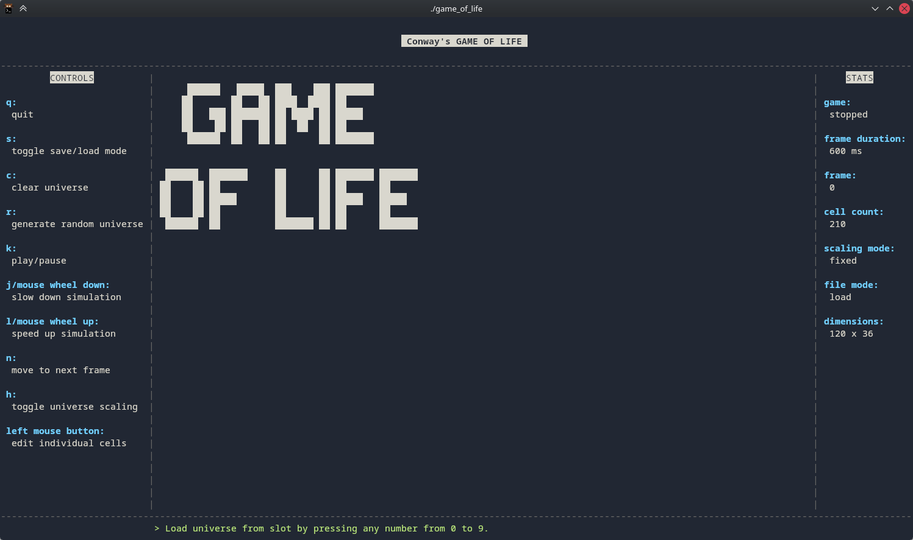
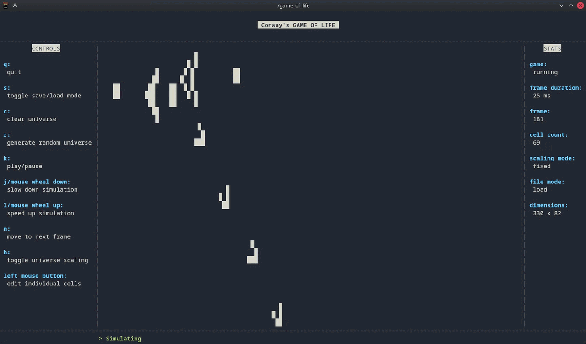

# Conway's Game of Life (TUI)

A Terminal User Interface (TUI) implementation of Conway's Game of Life, written in C using the `ncurses` library. This project features a playable simulation within your terminal, complete with customizable dimensions and state persistence.



## 🚀 Features

- **Interactive TUI**: Smooth rendering and input handling via `ncurses`.
- **Dynamic Universe**: Supports resizing the game world during runtime.
- **Save/Load System**: Simple text-based format to save and load different universe configurations.
- **Engine**: Follows the widely known rules of Conway's Game of Life



## 🛠️ Prerequisites

Before compiling, ensure you have the following installed on your system:

- **C Compiler** (e.g., `gcc`)
- **ncurses library**
- **Make** (to automate the build process)

On Ubuntu/Debian, you can install dependencies via:

```bash
sudo apt install libncurses5-dev libncursesw5-dev build-essential
```

On Arch:

```bash
sudo pacman -S ncurses base-devel
```

## 🔨 Installation & Running

1. **Clone the repository**

```bash
git clone https://github.com/Yazaaan/game-of-life-tui.git
cd game-of-life-tui
```

2. **Build the project:** The project uses a `Makefile` for easy compilation. Simply run:

```bash
make
```

3. **Run it:**

```bash
./game_of_life
```

## 🕹️ How to Play

- **Controls**: Use your keyboard to interact with the simulation. Edit the Universe with your mouse.
- **Resizing**: The engine handles terminal resizing
- **Save your work**: Save or load your Universe in one of 10 Slots. (Stored in `saves/`)
